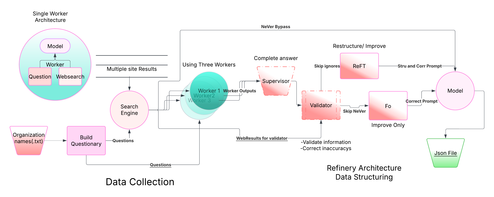

Deep Research Agent Framework
============================

A modular, multi-agent research pipeline built for structured, factual, and scalable intelligence.

Built to mimic human-level research, this system combines local LLMs, intelligent validation, and hallucination-resistant architecture to deliver high-quality answers from noisy, unstructured data on the web.

What It Does
------------

This framework automates deep, factual research across domains like:

- Academic & Scientific Literature
- Legal Document Analysis
- Pharmaceutical & Clinical Research
- Policy & Regulatory Intelligence
- Organizational / Competitive Research
- Technical Documentation Mining

Highlights
----------

- Search + Structure: Scrapes the web for answers, outputs clean JSON
- Multi-Agent Design: Workers, Validator, Supervisor, all modular
- Refinery Stack: ReFT + Fo improve reasoning and readability
- Small LLM Optimized: Built to run fast on models like:
  - LLaMA 3.2 3B
  - Gemma 2B
  - Phi 2
- Hallucination Resistant: Validates via external sources, avoids long-context traps
- Research-Ready Output: Structured, fact-checked JSONs — ready for RAG, dashboards, or further modeling

Architecture Overview
---------------------

Input Queries or Entity List -> Question Generator -> Search via Tavily API
-> Parallel Workers (LLM-powered) -> Supervisor: Structure + Merge
-> Validator: Fact-check + Improve -> ReFT + Fo Refinery -> Final Model Enhancement
-> Clean JSON Output

File & Module Guide
-------------------

- main.py           - Pipeline controller
- questions.py      - Custom questions per domain or entity
- searchengine.py   - Search wrapper (Tavily API or swap your own)
- worker.py         - Per-question LLM extractors
- supervisor.py     - Merges answers into structured format
- validator.py      - Checks for factual consistency and hallucinations
- refinery.py       - Runs ReFT and Fo to refine outputs
- llm.py            - Connects to Ollama for local model inference

How to Run It
-------------

1. Install Dependencies
   pip install requests tavily-python python-dotenv

2. Setup .env
   TAVILY_API_KEY=your_tavily_key

3. Add Your Entities or Topics
   Example: input.txt with list of companies, case laws, drug names, etc.

4. Run the Agent
   python main.py

5. Output
   research_output.json with refined, validated answers for each input entity

Why This Matters
----------------

The real power is in the validator + refinery stack:

- Hallucination Resistance: Small LLMs can reason, but often lack context. This system gives them a second pass for truth.
- Structured Thinking: Like a research analyst, it doesn't just answer — it cross-verifies, formats, and prioritizes.
- Fast & Local: No OpenAI or Anthropic required. Run on a laptop, scale with a cluster.

Built With
----------

- Tavily API
- Ollama for local inference
- Custom prompt engineering
- JSON-first pipeline design

License
-------

MIT — use it, fork it, break it, improve it.

When You're Ready to Launch
---------------------------

Whether you're:
- Publishing a paper
- Productizing it
- Scaling to a team or org

Let’s plug it in and take it further. Everything’s modular and ready to scale.
